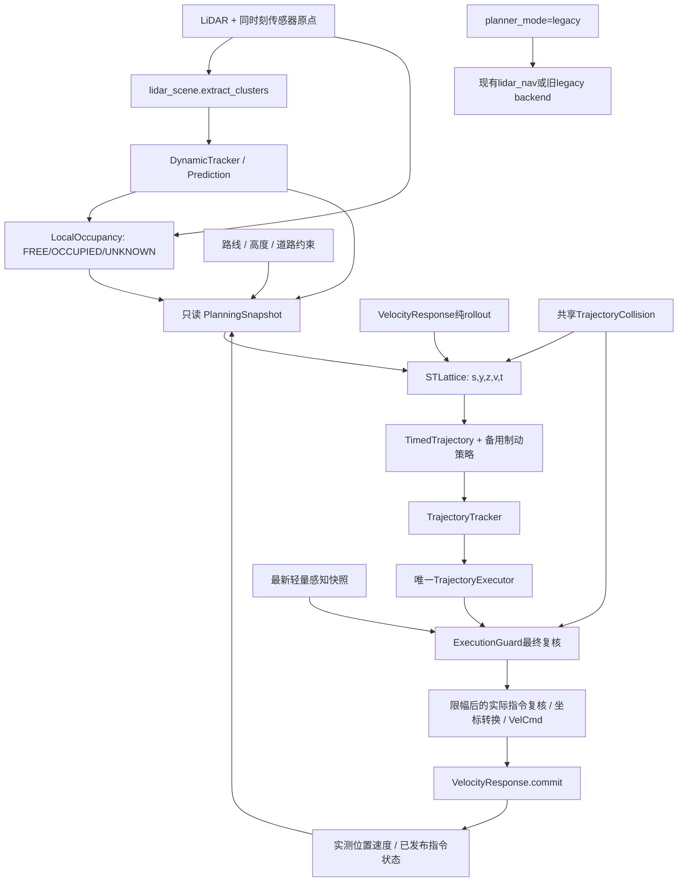

# 动态避障重构设计审查（2026-10-07）

依据：[重构方案](specs/RMUA2026_dynamic_avoidance_refactor_plan.md)，重点对应第24、36、37节。

**本文记录Phase 1审查时的代码和基线，设计已于2026-10-07获用户确认。Phase 2跟踪/预测、Phase 3三态地图及Phase 4离线时空MVP/必需响应接口已实现，见[Tracker](27_dynamic_tracker_implementation.md)、[Occupancy](28_local_occupancy_implementation.md)和[时空MVP记录](29_spacetime_mvp_implementation.md)。** 执行层后续已实现，运行副本已同步，见[收尾记录](30_spacetime_execution_implementation.md)；真实运动和赛事验收仍未完成。下文“当前调用链”指确认前的候选57基线；最新实施状态以当前交接和实现记录为准。历史代码及其未提交改动完整保留。

## 1. 当前实际避障调用链

Git 仓库在 `repo/`，源码在 `ros_ws/src/route_follower/`，Docker实际运行的是工作区 `rmua_ws/src/route_follower/`。当前两份控制包53个文件逐项一致，清单见[基线 manifest](../../experiments/dynamic_avoidance_refactor_20261007/baseline_manifest.json)。HEAD `665560d`不能代表当前完整版本，已有大量未提交改动。

当前主要入口由 `adaptive_speed` 与 `obstacle_backend` 决定：

```text
PointCloud2 → RouteFollower.lidar_cb → valid_points
  → _transform_cloud：PoseHistory按点云时间插值位姿 → 世界NED点云
Pose回调 → MotionEstimator：实际XYZ速度
路线/门/高度参考 → XYTracker / ReferencePlanner / SpeedScheduler / ZController
  → _control_loop生成desired XYZ
  → LidarNavigator.select                         [obstacle_backend=lidar_nav]
      → ExecutionGuard._update → PointIndex（原始点+实测支撑面）
      → LidarScene.update → 动态cluster/速度估计
      → path / GeometryProcess → 无时间维度的(s,y,z)几何路线
      → _usable_path复核缓存连接与道路/地面
      → _commands → VelocityResponse.prepare / forecast / envelopes
          → 道路/地面 + 原始点/面 + LidarScene.distance(samples,times)
          → 选一条短时速度指令
      → 无可用指令时：高度恢复/escape搜索/Guard制动回退
  → CommandArbiter.finalize：限幅、世界XY转机体XY
  → _recertify_publication：最新位姿/点云重新检查实际最终指令
  → publish → VelCmd → VelocityResponse.commit（记录实际已发布指令）
```

另一条旧入口为 `obstacle_backend=legacy`：`_plan_avoidance → AsyncPlanner → PredictiveAvoidance.evaluate → 空间Detour/Lattice → ExecutionGuard.evaluate/filter_command`，并带独立shift/retreat分支。这不是当前默认LiDAR导航的几何规划器。

**对原方案问题判断的校正：当前并非完全没有动态检查。** 动态检查已出现在LiDAR候选指令与停止包络中；缺失的是在上游路线搜索中同时选择空间、速度、到达时刻。现有动态软代价、左右偏好和速度枚举不能替代时空搜索。

## 2. 当前 Planner 入口

| 代码 | 当前职责 | 重构边界 |
| --- | --- | --- |
| `route_follower.py:RouteFollower._control_loop` | 任务参考、名义XYZ控制、调导航、复核、发布 | 添加明确的规划模式分流；后续将重规划与唯一发布者分开 |
| `lidar_navigation.py:LidarNavigator.select` | 当前LiDAR导航公共入口，返回command/info | 保持现有接口可回退；新模式走单独协调模块 |
| `lidar_navigation.py:LidarNavigator.path` | 沿路线约24m前向分层几何搜索 | 仅旧模式保留；不向其追加时间补丁或恢复状态 |
| `lidar_navigation.py:_plan_snapshot / GeometryProcess` | 隔离几何计算，接收数值快照 | 借鉴快照、超时和作废机制；新worker不得访问live Guard |
| `lidar_navigation.py:LidarNavigator._commands` | 路线lookahead与速度候选，响应预测后选指令 | 仅旧模式保留；新模式直接交付带时刻的轨迹和命令序列 |
| `predictive_avoidance.py:PredictiveAvoidance.evaluate` | 更早的空间避障入口 | 保留原backend；不用于时空模式 |

当前已有的 `obstacle_backend=legacy` 与方案建议的 `planner_mode=legacy` 容易混淆。拟新增独立 `planner_mode=legacy|spacetime`：`legacy` 表示保留现有backend行为，默认现有 `lidar_nav`；`spacetime`表示新LiDAR时空流水线。配置校验禁止静默退回其他规划器，模式与实际backend都写入遥测/版本清单。

## 3. 当前 Dynamic Scene 入口

`LidarNavigator.select` 调用 `LidarScene.update(points, position, cloud_stamp, pose_stamp, forward, center, s)`，随后赋给 `guard.dynamic_scene`。`ExecutionGuard.command_clearance`利用 `envelope_times`查询 `scene.distance`。

当前 `lidar_scene.py` 实现：路线附近ROI、0.45m世界网格、膨胀连通分量、cluster bbox；最近中心预测关联；边界平移一致时做速度指数滤波；短时保留遮挡的运动簇。预测用匀速模型和随时间线性增长的固定经验膨胀。

不足：没有稳定track ID、没有一对一关联约束、没有Kalman协方差；一个旧track可能被多个cluster使用；低速/支持不足的簇不会进入动态距离检查。bbox只覆盖可见回波，不等于完整车体。

拟先把聚类拆成纯函数 `extract_clusters`，返回bbox、质心、回波归属、数量及边界截断标记，保留旧类行为。新增 `DynamicTracker`：

1. 在世界坐标按真实观测间隔做CV Kalman预测，状态 `[x,y,z,vx,vy,vz]`，过程噪声表达未建模加速度。
2. 关联用带门限的一对一分配，结合预测协方差、bbox重叠和尺寸变化；被拒绝的配对不能强制关联。
3. 区分tentative/confirmed/coasting/lost生命周期；短时遮挡预测并增加协方差，过期删除；重复时间戳不重复滤波，时钟回退/reset清空。
4. `DynamicObstacle`携带ID、物理bbox、观测时间、最后更新时间、观测次数、age、confidence、位置/速度协方差，及默认零的加速度字段。第一版不以加速度字段进行CA预测。
5. `predict_at(stamp)`返回未来中心、bbox、协方差和膨胀量；`predict(dt)`明确相对于快照epoch，禁止混用观测龄和预测时间。
6. stationary与低速track仍有几何占据；未知类别称动态障碍track，不从LiDAR聚类直接宣称车辆语义。

日志逐track显示当前位置、速度、1s/2s预测、置信度和协方差。Phase 2先在离线连续点云/旁路日志上验证，不替换现有Planner。

## 4. VelocityResponse 在哪里进入

模型在 `RouteFollower.__init__` 与 `_on_teleport`创建，挂在 `execution_guard.response_model`。重置和首次初始化都必须覆盖新模块，不能只修改其中一个构造分支。

当前使用点：

- `_commands`执行 `prepare`（上一条指令的slew、反向制动、垂直耦合补偿），`forecast`打分，`envelopes`覆盖保持指令与完整停止尾段。
- Guard的 `command_envelope/filter_command/escape`使用同一模型。
- `publish`在真正发出指令后调用 `commit`；候选试算不能提交执行状态。
- `response_native.py`选择ABI12 native实现，Python是参考路径；保留已有多响应情景与80/160/400ms反馈情景。

**当前API不足以直接执行多段时空搜索。** `forecast`只返回单次恒定指令后的终点；`envelopes`是恒定指令后停车，并把多个情景拼接成采样集，不能当作连续多primitive的状态。拟新增无副作用的 `rollout_primitive(response_state, target, dt, profile, params)` 与带时间/情景的 `rollout_sequence`，复用现有迟滞、slew、反馈、耦合方程。返回样本和末端position/velocity/command状态；禁止对live模型反复 `commit`或重复补偿。

搜索展示状态保持 `(s,y,z,v,t)`，其中 `v` 为沿路线实际速度；节点必须额外携带世界XYZ速度、上一条名义/已施加指令、情景末状态。至少将离散侧向/垂直速度与影响slew的指令记忆纳入去重或保留多标签：同一五元组、不同惯性的节点不能直接合并。否则第一步绕车后的残余侧向速度会在第二步消失。初版小范围离散，不做完整自由世界搜索。

## 5. ExecutionGuard 在哪里进入

当前Guard同时承担观测索引、空间路线cap、响应碰撞检查、候选制动选择和escape认证；LiDAR模式的主检查已经内嵌在 `select/_commands`，最后由 `_recertify_publication`复核。不能仅在新Planner后继续调用整个旧 `filter_command`并称Guard已降级。

拟新增时空轨迹复核入口，复用 `trajectory_collision.py` 的纯检查函数。该入口负责：

- 新观测推翻计划，位姿/点云/track过期，计划异常/过期或epoch失效。
- 实际速度、位置偏离轨迹，以及实际限幅后指令是否仍符合已验证预测。
- 同一响应情景、同一停止策略、同一道路/地面边界下复核执行前缀及制动尾段。
- 返回PASS或拒绝的具体原因及首个冲突的时间、位置、track/voxel、最小间距。拒绝后切至已检查的制动策略；制动也不可认证时明确EMERGENCY_BLOCK/FAILSAFE，不能标成安全等待。

新模式不调用旧的shift/retreat/escape搜索。旧Guard入口仍用于旧模式和回归测试。规划器与Guard使用同一碰撞定义、响应参数和时钟基准；Guard只在执行误差、观测变化或故障时介入。

**执行时序是上线前必需条件。** 现有 `rospy.Timer(20Hz)`的回调仍计算候选包络/索引/复核后才发布，不是独立固定周期执行器。[第58轮时序证据](../../experiments/drone_avoidance_research_20261004/publication_timing58.json)显示188条发布中间隔P95为1.074s、最大2.191s，57个间隔超过默认hold=0.35s；187次发布复核中67次替换。仅改Planner不能保证真实控制按轨迹时刻执行。

拟由唯一 `TrajectoryExecutor`负责周期执行、最终检查、转换与发布，重计算在worker完成。20Hz为待测目标，5–10Hz为规划目标；超时不是继续保持旧前进速度。ROS/sim时间用于轨迹/观测，单调时钟用于计算deadline/回调失联；暂停、时钟回退、teleport、切段均作废旧epoch。先核对桥接VelCmd持续时间：本地 `airsim_ros`只有消息/服务，消息中没有命令有效期字段，不能凭发送间隔推断模拟器实际持有时间。独立执行与故障注入通过前，不将新模式默认上线。

## 6. 保留与复用的代码

| 保留模块 | 复用内容 | 限制 |
| --- | --- | --- |
| `lidar_points.py`、`pose_history.py` | 有效回波、同时间位姿插值与坐标变换 | occupancy需要额外保存该帧LiDAR传感器世界原点 |
| `lidar_scene.py` | ROI、网格cluster、bbox计算 | 旧类保留；新tracker采用一对一关联与Kalman |
| `point_index.py` | 精确点查询、有限实测支撑面、地面/顶面约束 | 原始回波作为保守辅助；不得把动态track回波永久当成静态墙 |
| `path_sampling.py` | primitive空间细分 | 加时间索引和情景索引，禁止只查节点终点 |
| `velocity_response.py`及native | 标定响应、控制slew、耦合、停止反馈、多情景 | 新增纯rollout接口；native迁移必须对照Python |
| `execution_guard.py` | 新鲜度、最终实际指令复核、完整制动与道路检查 | 新模式采用纯认证接口，不搜索绕行路线 |
| 路线/高度/任务模块 | 既有中心线、投影、坡度、高度、切段、门与终点 | 不重写SLAM、门感知与任务流程 |
| `motion_estimator.py`、`command_arbiter.py` | 实测速度与输出坐标转换/限幅 | 最终改变指令后必须验证其预测，防止认证后改速度 |
| `lidar_navigation.py`、`predictive_avoidance.py` | 完整旧backend与回归基线 | 仅旧模式执行 |
| 现有工具/实验 | 启动版本快照、遥测、原始点云和审计 | 每轮新目录，不覆盖旧证据 |

道路约束初版沿用当前经验中心带与高度范围；它们不是官方真实边界测量，不能在文档中称严格赛道安全证明。

## 7. 废弃的行为

“废弃”指在 `spacetime` 分支停止使用，首阶段不物理删除旧代码：

- 先选无时间空间路径，再用短指令枚举反复补救其可行性。
- 左/右偏好路线轮换、局部escape、高度恢复和shift/retreat作为日常车辆避障策略。
- Guard不断生成新方向或从大量Z指令中选“最不差”的避障路线。
- 缓存路径没有时间有效期、仅依赖几何连接可用就继续执行。
- 只有统一BLOCKED原因、不区分等待/无路/紧急失效。

旧backend仍可显式配置使用。新模式第一版只提供NORMAL/PLANNING/EMERGENCY_STOP/FAILSAFE执行模式；等待是时空轨迹动作和Planner结果，不新增恢复状态机。第一版无主动后退primitive。

## 8. 新增模块、数据契约与核心约束

### 模块职责

| 新模块 | 职责 |
| --- | --- |
| `dynamic_tracker.py` | 稳定ID、一对一关联、CV Kalman、生命周期、带不确定度预测 |
| `local_occupancy.py` | rolling voxel map、ray casting、FREE/OCCUPIED/UNKNOWN、时效、回波归属 |
| `route_coordinates.py` | 冻结的路线采样/投影、世界↔(s,y,z)、道路/高度/地面边界共享定义 |
| `trajectory_types.py` | 只读快照、响应状态、带时间的轨迹、计划有效期及详细结果 |
| `trajectory_collision.py` | 同步时间的静态/动态/未知/道路/动力学检查与风险代价 |
| `st_lattice.py` | 有deadline的Weighted A*、响应primitive、等待与轨迹commitment |
| `spacetime_navigation.py` | 感知快照、worker任务、新旧模式适配和result交接 |
| `trajectory_tracker.py` | 按轨迹时间执行、限制跟踪修正、反馈偏差检测 |
| `trajectory_executor.py` | 单一执行/发布、过期与备用制动策略、reset/切段作废 |
| `planning_visualization.py` | ROS MarkerArray，只订阅/读取诊断快照，不阻塞执行 |

### 时间与交接

`PlanningSnapshot`至少含：epoch、scene_version、pose_stamp、cloud_stamp、传感器原点、position/velocity、response_state、route/边界采样、占据快照、track快照、模型/参数版本。

`TimedTrajectory`至少含：plan_id、epoch、scene_version、start_stamp、valid_until、样本 `t/position/velocity/nominal_command/applied_command`、响应情景、cost、备用制动策略/高度参考、验证结果。时空中的障碍查询统一为 `snapshot.start_stamp + sample.t`，绝不把车辆当前点云和无人机几秒后的位置直接比较，也不把cloud age加两次。

`PlanResult`含轨迹或失败原因、候选数、各类拒绝数、耗时、是否预算耗尽、首个冲突。结果晚到、epoch不符、最新观测/实际运动无法复核时丢弃，旧轨迹只在仍有效且安全时续用。

### Occupancy与动态点云

- 世界对齐rolling局部网格初始resolution=0.5m、前向约25m、横向±4m；垂向由实际道路约束与安全膨胀决定，不构建全局地图。规划前向范围上限25m。
- ray从**点云采集时刻传感器原点**出发；当前变换含机体Z偏移-0.05m，不能用规划时刻无人机位置代替。原点随该帧点云保存，不能只保留世界hit point。
- 单帧hit优先于同帧其他ray的FREE；遮挡后的体素UNKNOWN；范围外、无效/空观测、过期观测均不能标成已知安全。
- UNKNOWN在首版执行前缀和备用停止轨迹中硬拒绝；远期穿越未知也不能认证为完整安全路线，可返回到已知空间末端的安全短轨迹。未知阻塞单独记录，不用道路先验伪造FREE。
- 可信关联的动态回波从静态层按回波/voxel归属分离，由时间相关bbox负责占据。未确认、低置信度、尺寸截断与未关联点仍保守保留；混合voxel不能因单个track移动而清除静态点。
- 动态物体旧位置不能永久留在static层，也不能因确认运动立即宣称隐藏的原车位FREE；以真实新ray和观测时效处理。失去track时保留有限时效的保守占据，过期转UNKNOWN。
- Planner与Guard同时使用上述分层模型，避免Planner放行未来空位、Guard仍因当前车身回波否决。原始点/支撑面保守复核也必须明确时间/归属。

### 搜索与碰撞

- Weighted A*搜索路线坐标，起点为实测位置与惯性；速度档初始0/2/4/6/8m/s，受当前配置上限约束，时间步0.25s、s/y/z离散约1/0.5/0.5m，3–4s时间窗口。
- primitive有限枚举纵向保持/加减速与横向/垂向动作；WAIT通过真实模型减速后保持，不能让非零速度节点瞬间变成静止。
- 每次扩展用纯VelocityResponse生成整段真实响应样本，并延续各情景末状态；检查所有样本及连接段，按相同绝对时刻预测障碍。多情景不允许平均后认证。
- 动态bbox膨胀由尺寸、无人机几何/既有margin、协方差随时间增长组成，margin只应用一次；ROI截断bbox增大不确定度，不视为精确尺寸。
- 硬约束含静态、动态、UNKNOWN、道路/高度/地面、实际速度/加速度/横纵向限额；通过后才比较progress、time、centerline、altitude、风险、acceleration、jerk、uncertainty、switch cost。
- deadline到达只交付已有且完成检查的安全短轨迹，否则制动。SEARCH_TIMEOUT与真正NO_PATH区分；不得把未搜索完称为无路。
- WAIT_FOR_DYNAMIC要求存在可认证的减速/等待轨迹及动态时间阻塞证据；UNKNOWN_BLOCKED与静态NO_PATH单列。EMERGENCY_BLOCK是当前执行失效且安全停止不可保证，与规划等待不同。
- 轨迹commitment约0.4s，续用前仍按新观测和实际位置/速度复核；遇新危险立即打破commitment。后续改变拓扑要满足更优代价阈值，不能靠锁住方向跳过检查。
- 执行轨迹的第一个可发布前缀必须连同完整停止尾段检查；可执行范围由停止尾段认证覆盖，不受3–4s搜索窗口截断。备用制动是按经验证反馈周期执行的控制策略与覆盖轨迹，包含高度与耦合补偿，不是简单XYZ归零。

## 9. 新旧模块调用关系



最终限幅应在Guard最终认证前应用，认证后只作等价坐标转换。旧backend保留原调用链；新模式规划失败时只制动/重规划，不自动切回旧恢复搜索。

诊断用 `/rmua/controller/planning_debug`，可视化用 `/rmua/controller/planning_markers`：FREE绿、静态红、动态当前位置蓝、未来bbox橙、候选黄、选中轨迹紫。Marker注明预测时刻/ID/epoch，有界抽样并清除旧ID；用明确NED frame或显式变换，不假定RViz默认Z向上就是当前世界坐标。

## 10. 第一阶段具体修改文件与实施顺序

所有路径相对 `repo/`。每批有独立可审查结果；保持旧默认，完成A/B与重复车辆整段验收后才切默认spacetime。

| 批次 | 新增 | 修改现有文件 | 验证与交付 |
| --- | --- | --- | --- |
| Phase 1（本次） | 本设计文档、工作区基线manifest与测试日志 | 文档入口/当前交接 | 真实调用链、保留/废弃边界、设计确认 |
| Phase 2：Tracker | `ros_ws/src/route_follower/scripts/dynamic_tracker.py`；`tools/tests/test_dynamic_tracker.py`；`tools/replay_dynamic_tracker.py` | `scripts/lidar_scene.py`仅抽纯聚类；`CMakeLists.txt`安装新模块；现有测试按需增补 | 一对一ID、速度符号、可变帧率、短遮挡、重复帧、reset、协方差增长；连续历史重放1s/2s预测误差，先不改Planner |
| Phase 3：Occupancy | `scripts/local_occupancy.py`；`tools/tests/test_local_occupancy.py` | `scripts/route_follower.py:_transform_cloud`保存同帧sensor origin；`CMakeLists.txt` | ray hit/free/unknown、hit优先、遮挡、滚动、时效、动态层归属、旋转位姿原点 |
| Phase 4：离线时空MVP | `scripts/route_coordinates.py`、`trajectory_types.py`、`trajectory_collision.py`、`st_lattice.py`；`tools/tests/test_st_lattice.py`、`test_trajectory_collision.py`、`test_route_coordinates.py` | `CMakeLists.txt`；`scripts/velocity_response.py`先提供最小纯primitive rollout；`tools/tests/test_velocity_response.py` | A/B/C/D/F合成动态场景、整edge检查、不同惯性不能合并、可认证等待、搜索预算、未知拒绝 |
| Phase 5：响应与连续执行预测 | `tools/tests/test_response_rollout.py` | `scripts/velocity_response.py`完整序列/多情景/停止策略；必要时 `scripts/response_native.py`及`src/velocity_response_native.cpp` | Python/native一致性、迟滞/历史指令、slew/耦合、停车尾段，不修改标定值来掩盖不一致 |
| Phase 6：新旧入口/执行与Guard | `scripts/spacetime_navigation.py`、`trajectory_tracker.py`、`trajectory_executor.py`；`config/spacetime_planner.yaml`；`tools/tests/test_trajectory_executor.py`、`test_spacetime_navigation.py`、`test_planner_guard_consistency.py` | `scripts/route_follower.py`初始化/reset/选择/唯一发布；`scripts/execution_guard.py`纯认证入口；`launch/route_follower.launch`；`tools/start_seed123_race.py`；`CMakeLists.txt` | plan有效期/epoch、过期结果拒绝、实际最终指令一致性、0.2/0.6/1.2/2.2s规划延迟/挂起/退出、失联与reset；核实VelCmd执行契约 |
| Phase 6：诊断与可视化 | `scripts/planning_visualization.py`；`tools/replay_spacetime_navigation.py`；`tools/summarize_spacetime_kpi.py` | `CMakeLists.txt`、`package.xml`加visualization_msgs；`tools/control_trace.py`按需加轨迹版本/Guard原因 | 首次冲突位置/时刻、轨迹/未来bbox、规划与发布耗时、Planner-safe/Guard拒绝差异 |
| Phase 7：性能/实跑 | 每轮独立实验目录、KPI报告 | 仅对已有模块做有证据的剪枝/cache/平滑 | 整段与重复验证后再切默认；不加恢复状态或视觉依赖 |

Phase 4先验证搜索结构，同时必须用Phase 5的最小响应接口；Phase 5将同一模型扩展为可认证的连续序列与实际备用策略。不能用理想直线MVP接飞行，再把响应模型留作后补。

### 验收门槛

沿用方案Case A–F：静态车提前绕过；横穿减速/等待后通过；双车反向时隙；暂时堵塞安全等待后恢复；突变速度重规划或紧急制动；静态窄通道无退化。另加新旧观测时间不同、未知区域、跟踪丢失、规划超时、执行失联、reset/切段作废。

共享checker先在同一冻结快照、同一已施加指令、同一时间基准下验证：Planner认证的前缀与停止策略必须被Guard通过。最新观测引发的拒绝另记，不能混入纯模型不一致；每次差异保存可重放输入。

记录成功率、碰撞、Guard触发/COMMAND_BLOCKED、规划平均/P95/max、实际发布间隔、均速、停车/后退、左右切换、通过耗时。规划目标5–10Hz，执行目标20Hz；以实测最坏耗时与故障制动验证，不以设置rate为完成依据。

真实比赛必须按当前交接的官方3→5终点切段与有效结果验收，并做重复验证；历史点云是开放循环数据，不能证明新控制指令下车辆区域真实通过。现有75000点设置须固定A/B条件，最终按原200000点复核。无需新增YOLO/双目/DL/RL/复杂MPC。

## 11. 本次基线验证与设计确认项

- 宿主机：`python3 -m unittest discover -s repo/tools/tests`，317项通过，见[宿主日志](../../experiments/dynamic_avoidance_refactor_20261007/host_baseline_tests.log)。日志中几何worker EOF为已有故障测试的预期输出，最终结果为OK。
- ROS容器：相同测试集317项通过，见[ROS日志](../../experiments/dynamic_avoidance_refactor_20261007/ros_baseline_tests.log)。两端结果均为OK；测试通过不代表车辆段实飞验收通过。
- 源码/运行副本53文件一致；未修改运行包。Docker中仍有第58轮模拟器及roscore，当前进程检查未见route_follower控制器，未启动、停止或重置模拟器。
- 已确认：按本文接口、保留旧默认与独立执行时序门槛推进；Phase 2实现与证据见[实现记录](27_dynamic_tracker_implementation.md)。后续不重复请求设计确认。

确认步骤依据用户提供方案第36节“在真正修改代码前……先……输出”“确认设计后再开始代码修改”，已完成。
